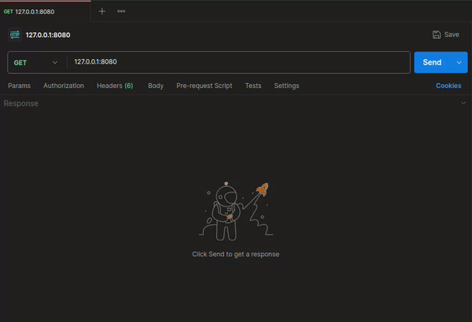
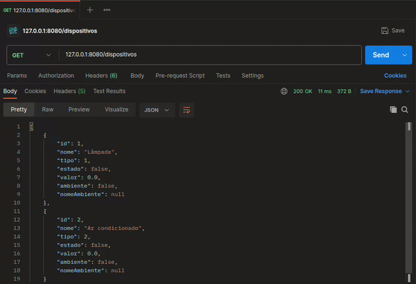
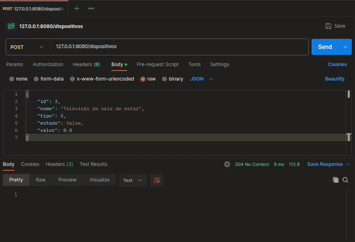
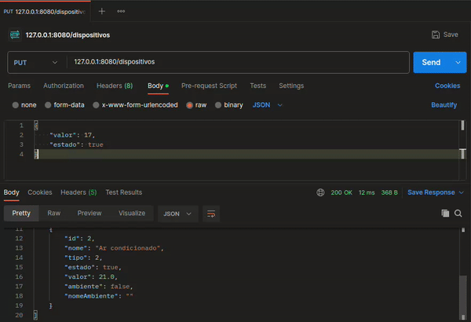
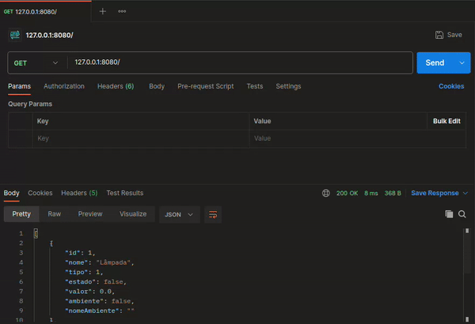
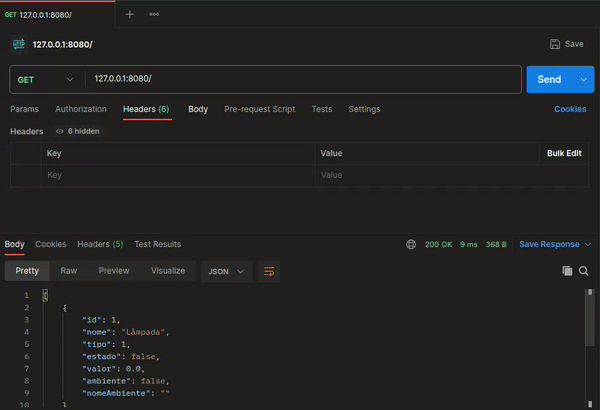
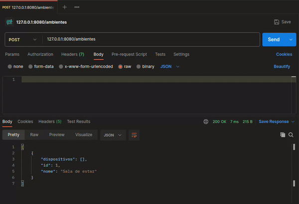
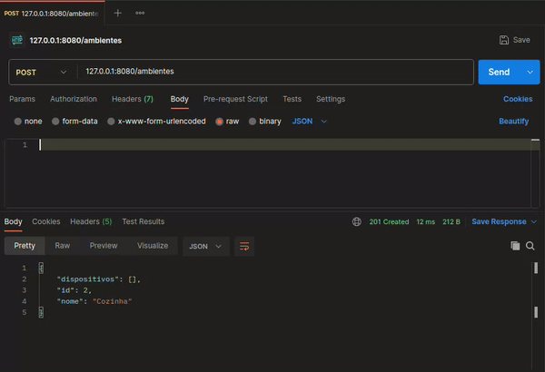
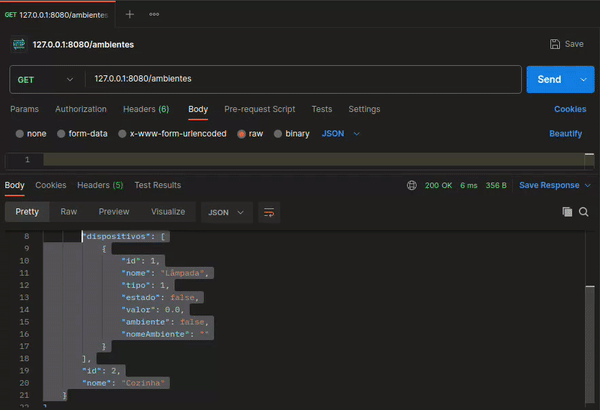
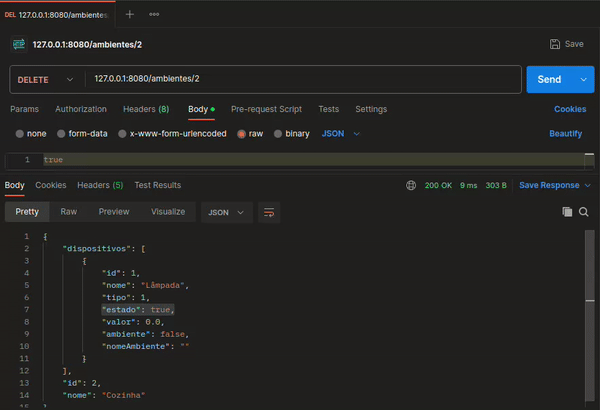

# Projeto de STD
Projeto final apresentado a disciplina de sistemas distribuídos no curso de Engenharia de Telecomunicações do IFSC-SJ

## Proposta de projeto

### Comunicação entre os dispositivos IOT e o servidor
Para registrar o dispositivo, haverá uma aplicação Java que se comunicará por RabbitMQ com o servidor, efetuando o registro do dispositivo. 

Esse registro ocorrerá com o envio de um formulário de informações do dispositivo IOT para o servidor. No inicio desse formulário, o dispositivo vai informar seu identificador único inicial, que é um [UUID](https://docs.oracle.com/javase/8/docs/api/java/util/UUID.html). O dispositivo enviará em uma fila de mensagem de registros esse formulário, o servidor vai ter uma linha de execução escutando essa fila de registros e efetuando os mesmos. Ao efetuar o registro, o servidor vai criar um novo ID para o dispositivo, e enviar a confirmação do registro para o dispositivo, informando para ele o seu novo ID. Esse ID será o nome da nova fila que o dispositivo vai ficar escutando, até o final de sua vida. È por meio dessa fila que o servidor vai poder se comunicar exclusivamente com o dispositivo, posteriormente.

### Comunicação entre o servidor e o cliente
O servidor também será uma aplicação Java, que registrará os dados em memória. Além disso, implementará uma API RESTful, que disponibilizará todos os recursos necessários para que o cliente possa usufruir de toda a capacidade dos dispositivos IOT, como por exemplo, alterar temperatura remotamente, ligar e desligar dispositivos, configurar ambientes (grupos de dispositivos), etc. Para ter acesso às funcionalidades fornecidas pela API, o cliente enviará solicitações HTTP. Será utilizado PostMan para simular essa interação. Mais detalhes sobre essa API RESTful poderão ser visualizados na [entrega-02](../entrega-02/).

Serão utilizados contêineres Docker para facilitar a gestão do projeto. Com a composição de contêineres iremos poder configurar e subir a aplicação de forma segura. Será utilizado principalmente para subir o RabbitMQ antes de subir o servidor ou algum registro, visto que a comunicação entre esses dois dependem do RabbitMQ. Outra importância da utilização do docker compose será para sincronizar os serviços e permitir que o produtor e o consumidor se encontrem. Visto que com a utilização de contêineres é possível utilizar um sistema que se assemelha a um "DNS interno", sem precisar implementar um servidor DNS e mesmo assim conseguir fugir do problema que seria utilizar endereços IP que podem ser alterados com o tempo e comprometer a aplicação

# Manual para compilar e executar o cenário de automação residencial

Inicialmente abra uma janela do terminal e insira o seguinte comando.

```bash
sudo docker-compose build
```

Após isso, no mesmo terminal, insira o comando a seguir:

```bash
sudo docker compose up rabbitmq
```

Após isso, deixe esse terminal aberto e abra um novo, então insira o comando a seguir:

```bash
sudo docker compose up servidor
```

Após isso, o servidor vai ter rodado, e podemos instanciar o/os dispositivos IOT desejados. Segue abaixo a lista de comandos para inserir no terminal que instancia cada um deles.

Ar condicionado:
```bash
sudo docker compose up arcondicionado
```

Caixa de som:
```bash
sudo docker compose up caixadesom
```

Cortina:
```bash
sudo docker compose up cortina
```

Lampada:
```bash
sudo docker compose up lampada
```

Televisão:
```bash
sudo docker compose up televisao
```

# Manual da API RESTFUL

A seguir serão mostrados exemplos do cliente interagindo com todas as funcionalidades da API RESTFUL implementada. Para cada verbo há um gif simulando uma requisição HTTP por meio do software Postman.

Obs: para fins de facilidade de simulação, ao se iniciar o servidor já terão 2 dispositivos diferentes cadastrados, assim a API RESTful pode ser testada mais rapidamente.

## dispositivos
### GET `/dispositivos`
Obtendo informações sobre todos os dispositivos
<p align="center">
  
</p>

### GET `/dispositivos/{id}`
Obtendo informações sobre um dispositivo específico
<p align="center">
  
</p>

### POST `/dispositivos`
Cadastrando um dispositivo
<p align="center">
  
</p>

### PUT `/dispositivos/{id}`
Alterando o valor ou o estado (ligar/desligar) do dispositivo.
<p align="center">
  
</p>


### DELETE `/dispositivos/{id}`
Deletando um dispositivo.
<p align="center">
  
</p>

## ambientes

### GET `/ambientes`
Obtendo as informações sobre todos os ambientes cadastrados.
<p align="center">
  
</p>

### GET `/ambientes/{id}`
Obtendo informações sobre um ambiente específico cadastrado.
<p align="center">
  
</p>

### POST `/ambientes`
Cadastrando um novo ambiente, com id 1 e nome "Sala de estar".
<p align="center">
  
</p>


### POST `/ambientes/{id}`
Adicionando ao ambiente de id 2 (cozinha), o dispositivo de id 1 (lâmpada).
<p align="center">
  
</p>

### PUT `/ambientes/{id}`
Ligando/desligando um ambiente (todos os dispositivos que estão no ambiente).
<p align="center">
  
</p>

### DELETE `/ambientes/{id}`
Deletando um ambiente.
<p align="center">
  
</p>


# Funcionalidades implementadas

- API RESTful com todas as funcionalidades previstas no escopo do projeto.

- Comunicação via fila de mensagens entre o servidor e o dispositivo IOT

- Protocolo de aplicação a comunicação entre o dispositivo e o servidor, de forma que cada dispositivo possa encontrar o servidor mandando seu formulário de registro em um canal de registro, e a seguir o servidor responda o formulário. Então o dispositivo fica em um canal de mensagens somente dele, onde ele recebe as mensagens do servidor, como por exemplo, alterar temperatura, ligar/desligar.

- Ambientes funcionando, é possível criar ambientes, colocar N dispositivos no ambiente e ligar/desligar ambientes.

- Código fonte dentro de contêineres docker.

# Funcionalidades não implementadas

- Há um bug no código que faz com que quando tenha concorrência de dispositivos, por mais que o servidor possa mandar mensagem para todos os dispositivos, apenas o primeiro a ser cadastrado recebe essa mensagem. Por exemplo: cadastrei o ar condicionado 1 e em seguida o ar condicionado 2, se o cliente quiser mudar a temperatura do ar condicionado 1, então ele vai mandar um put /dispositivo/1, aí o servidor vai mandar mensagem pro ar condicionado 1 alterar a temperatura e o ar condicionado 1 vai receber a mensagem e simular uma mudança de temperatura. Até aí tudo certo, funcionamento normal, mas se o cliente quiser alterar a temperatura do ar condicionado 2, ele vai fazer o mesmo processo, e quando o servidor mandar a ordem pra esse ar condicionado 2, o ar condicionado 2 não vai simular a mudança de temperatura, ele não recebe essa mensagem. Entretanto o servidor manda a mensagem normalmente pra esse ar condicionado 2.


.
